# MATLAB
## note.m
此文件为本人在大学学习MATLAB软件两年以来整理的部分笔记（采用markdown语言编写，Typora导出成pdf），临近毕业之际开源至github上以供各位学习~因本人为非cs专业与专门学习MATLAB的学生，笔记中如有疏漏还请各位指正，第一次开源文件不太娴熟，还大家谅解！
## GA_TSP 
**问题描述：** 一共8个城市，从起点城市`A`遍历其他所有城市后回到终点城市`H`，寻求一条路径使得总路程最短（详细的数学模型在`旅行商规划.doc`中）

**编码方式：** 代码中用`1`代表城市`A`、`2`代表城市`H`，eg.`1->2->3->4->5->6->7->8`代表路径`A->B->C->D->E->F->G->H`

**函数解释：**
+ `main` : 主函数文件
+ `data.mat` : 8个城市之间的距离矩阵
+ `cross` : 交叉操作，
+ `mutate` : 变异操作，两点变异
+ `obj`: 适应度函数，一条路径总路程计算
+ `popinit` : 初始化种群
+ `tourment_Select` : 锦标赛选择机制
+ `旅行商规划.doc` ： 具体数学模型
+ `test_qiongju` : __穷举验证__

**结果显示：**
GA运行的结果

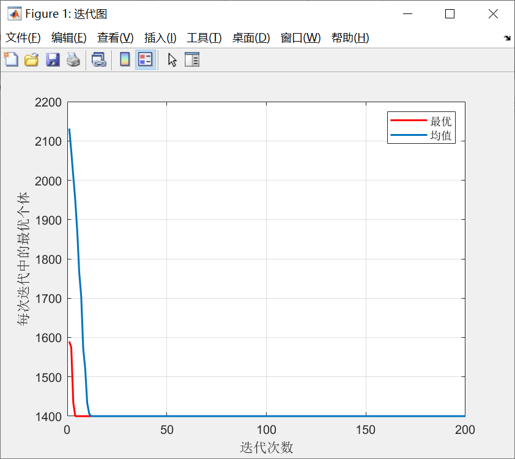
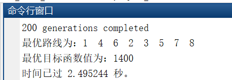

穷举验证的结果

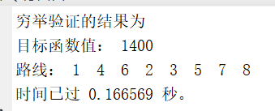

## GA_BP
**问题描述：** GA优化BP进行预测，样本量数据为72组，预测数据为18组，（部分函数的使用需安装GOAT工具箱）

**函数解释：**
+ `main` : 主函数文件
+ `data.mat` : 数据集，前三列为输入变量、后六列为输出变量
+ `getBPinfo` : 初始化BP网络
+ `gadecod` : 遗传算法实数编码
+ `gabpEval` : 适应值计算函数
+ `GOAT.zip` : GOAT工具箱

**GOAT工具箱安装步骤：**
+ 1.解压`GOAT.zip`文件，并记录解压后的位置
+ 2.`预设路径`->`添加文件夹`->`复制位置并点击GOAT文件夹`->`保存`

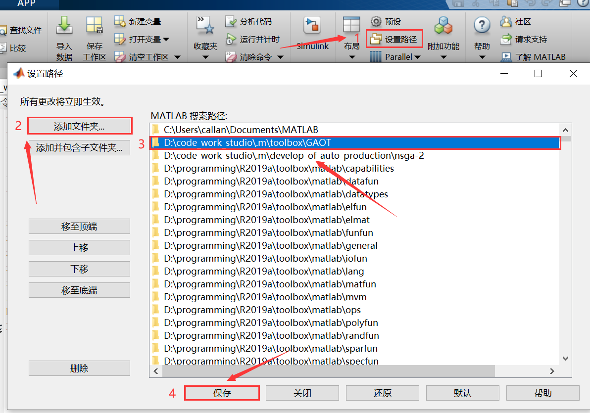

**结果显示：**

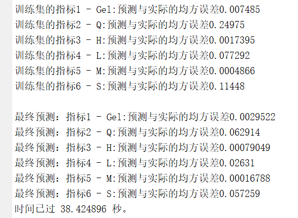
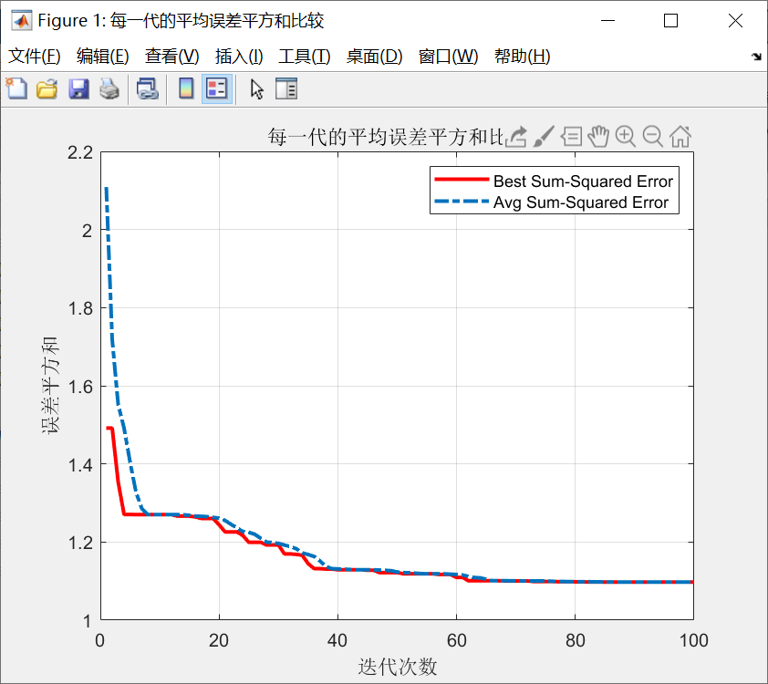
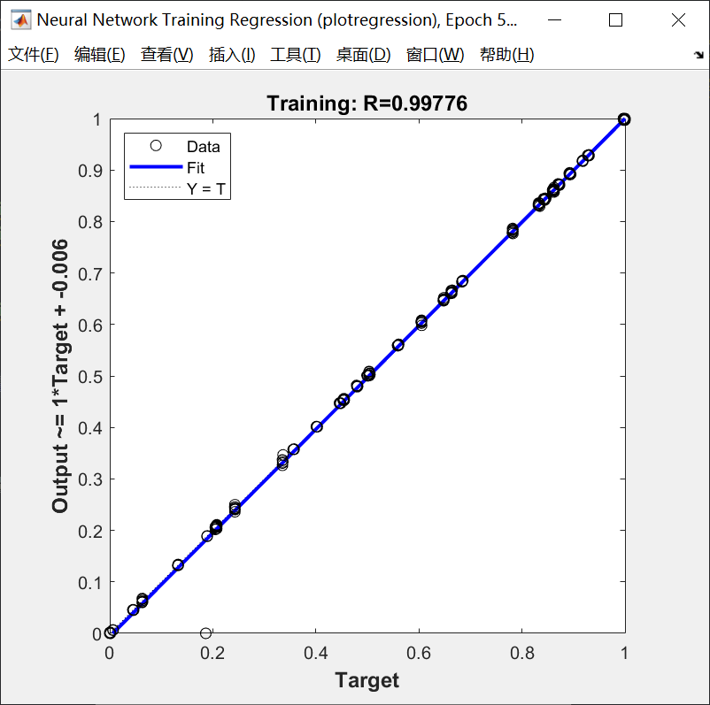
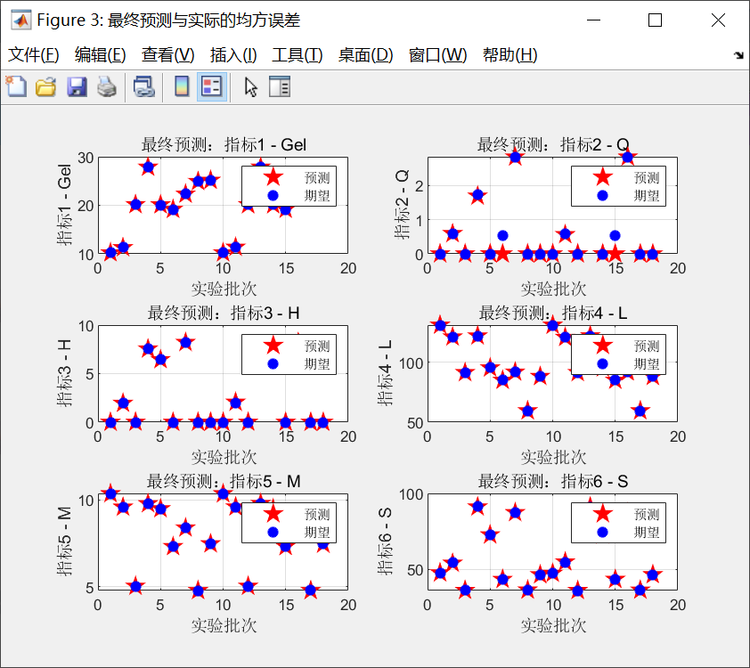
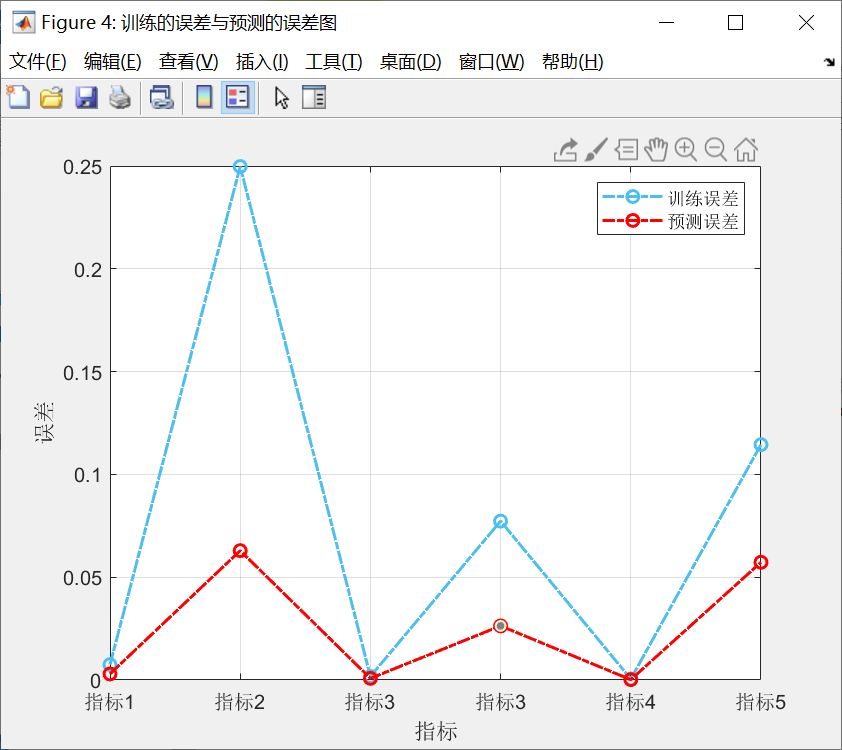

**神经网络工具箱解释图：**

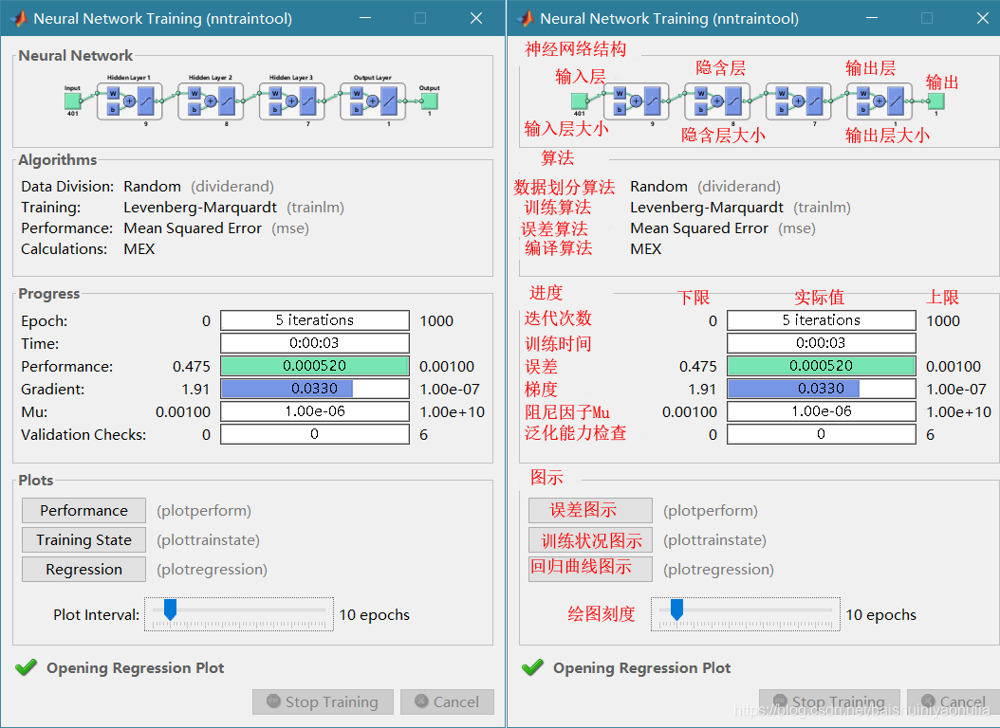

## SSA
**问题描述：** 使用SSA麻雀搜索算法进行函数寻优，输入三个参数且有区间限制，输出为一个。`main`可以照着看，函数的流程没问题的，其他细节忘记了....

**函数解释：**
+ `main_max` : 主函数文件—函数寻优找最大
+ `main_min` : 主函数文件—函数寻优找最小
+ `pop_init` : 初始化种群
+ `net.mat` : BP神经网络拟合的net值，用以计算目标函数值
+ `obj` : 适应值计算函数
+ `revise` : 修正函数

**结果显示：**

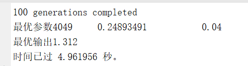
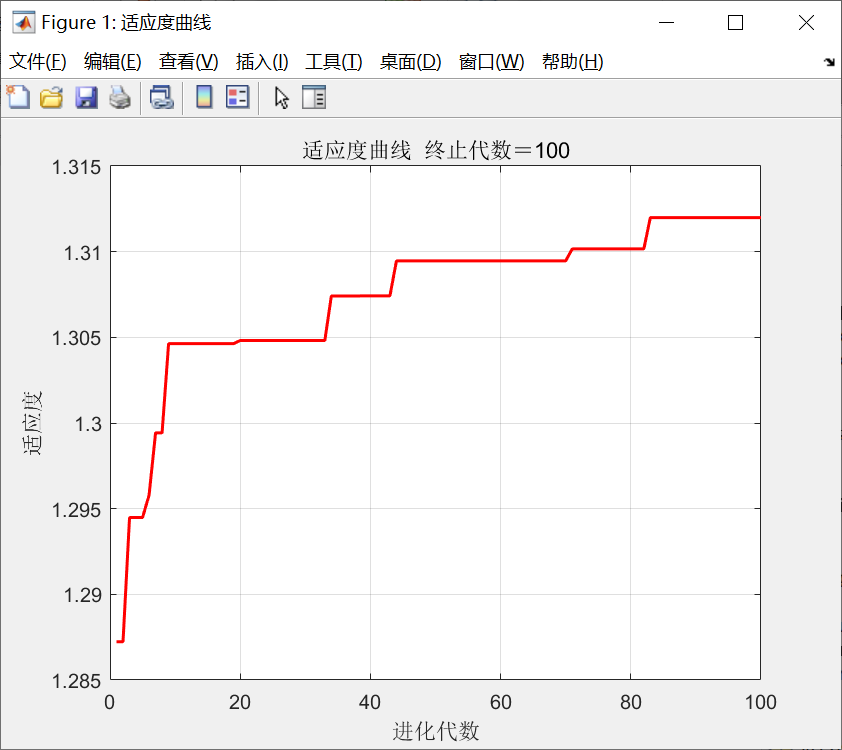

## GA_VRPTW
**问题描述：** 使用GA算法求解带时间窗车辆路径问题（vehicle routing problems with time windows，VRPTW），1个需求中心，25个顾客，模型是课程作业随便写的（详细的数学模型在`VRP_GA.doc`中）   
**编码方式：** 代码中用`>25的数字`代表`配送中心`、`1`代表`需求点1`...，eg.`26->1->2->3->4->5->27->6->7->8->28`代表配送路径`1->2->3->4->5`、`6->7->8`

**关键函数解释：**

+ `GA_VRPTW` : 主函数文件
+ `2.xlsx` : 模型的基础数据表
+ `init` : 构造初始解
+ `obj_fun` : 目标函数值的计算
+ `tourment_Select` : 二元锦标赛选择
+ `Recombin` : OX交叉操作
+ `Mutate` : 变异操作
+ `LocalSearch` : 局部搜索操作
+ `Reins` : 重插入子代的新种群
+ `deal_Repeat` : 删除种群中重复个体
+ `chrom_revise_1` : 软件窗的修正
+ `decode` : 解码操作
+ `Judge` : 判断最优解是否满足约束
+ `draw_Best` : 配送路线图的绘制

**结果显示：**

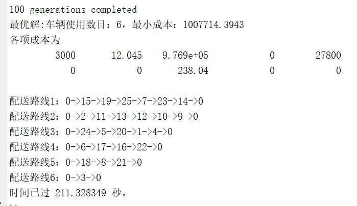
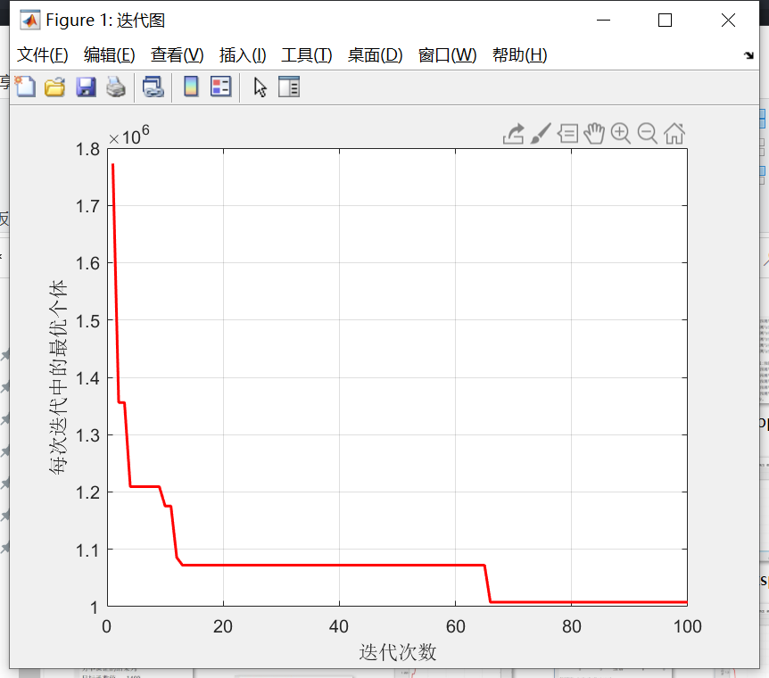
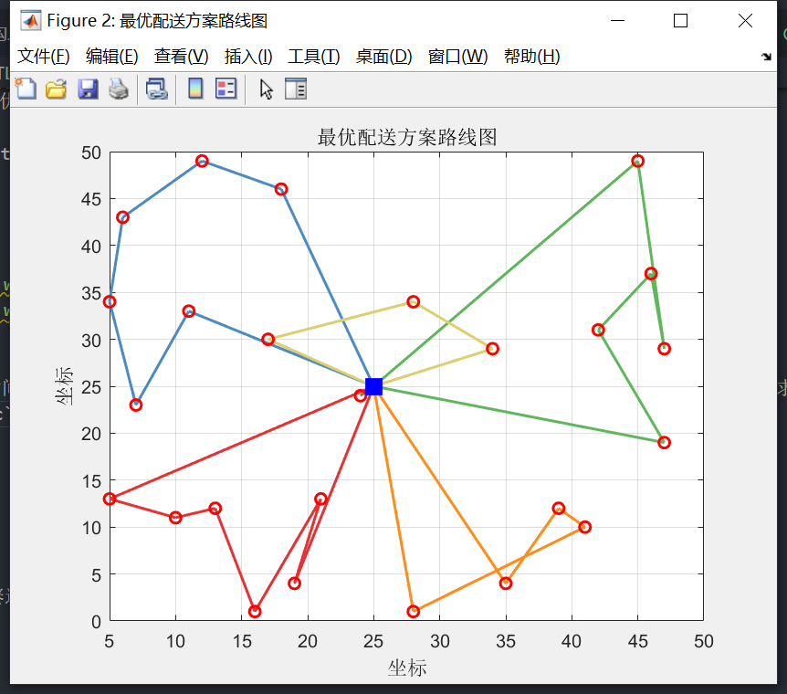

## Facility Location
**问题描述：** 传统选址问题：从25个需求点中选3个配送中心，使总成本最小。成本构成 = 建仓费用 + 库存管理费 + 配送中心向需求点运输所需要的运费（详细的数学模型在`问题描述.doc`中）

**函数解释：**

+ `main` : 主函数
+ `pop_init` : 初始化种群
+ `obj_fun` : 目标函数值的计算
+ `data.mat` : 数据文件
+ `data.xlsx` : 数据源

**结果显示：**

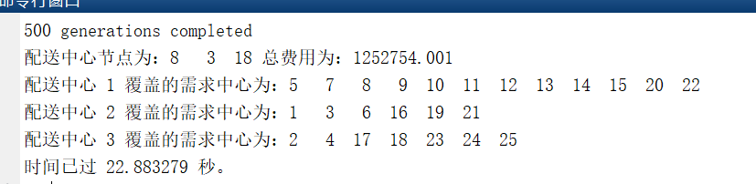
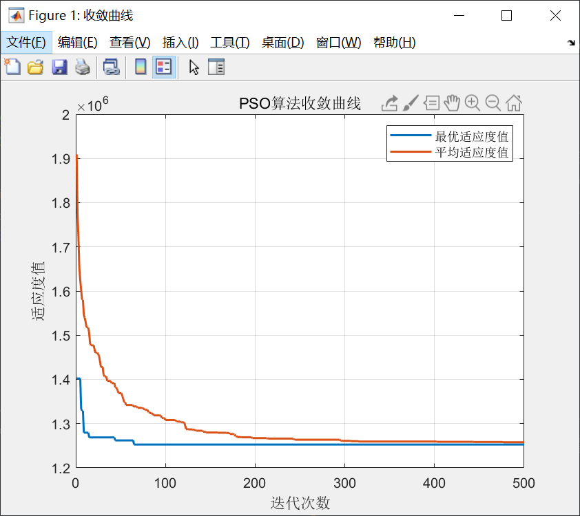
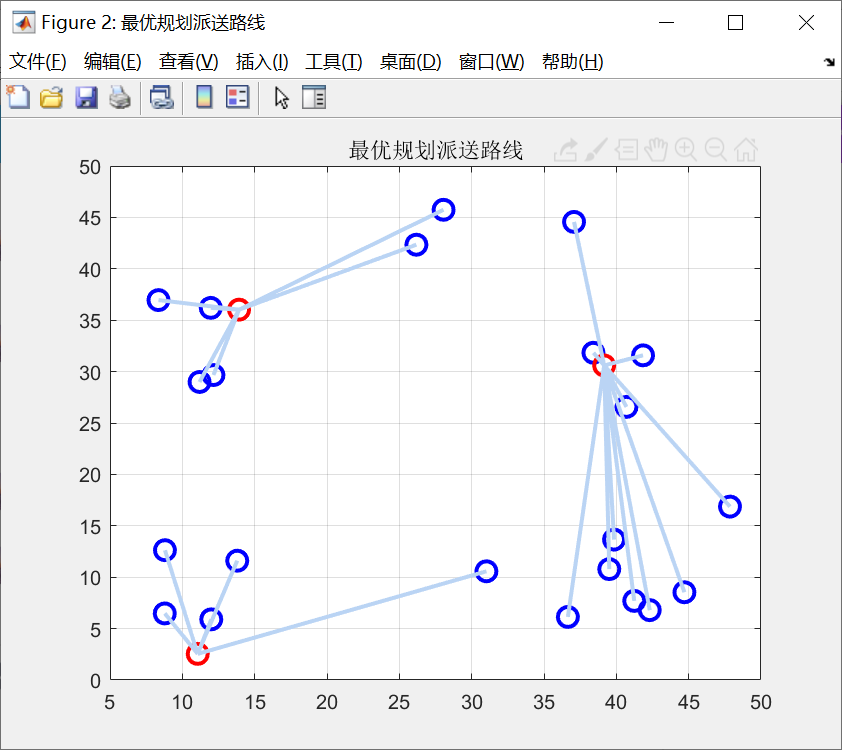

## amazing_problem
+ 1.  `question_1.m` : 
+ + __问题：__ 0-1000内是否存在一个直角三角形和一个等腰三角形，二者具有相同的周长和面积、且周长和面积均为整数
+ + __答案：__ 存在，(135,352,377)、(366,366,132)
